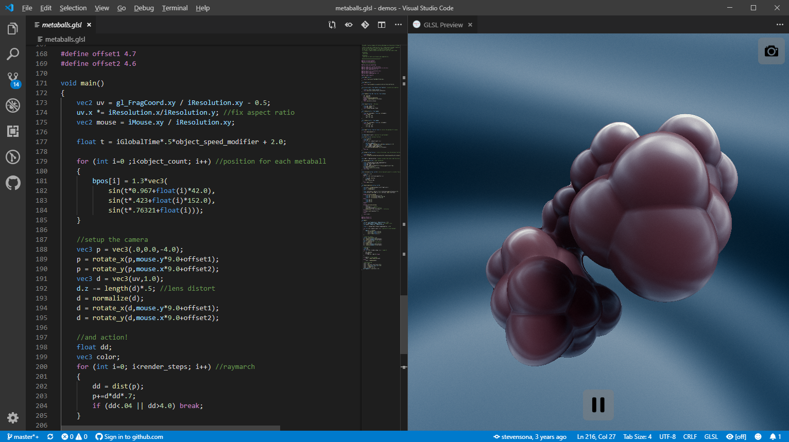

# Visual Studio Code - Shader Toy

With this extension, view a live WebGL preview of GLSL shaders within VSCode, similar to [shadertoy.com](https://www.shadertoy.com/) by providing a "Show GLSL Preview" command.



 Running the command splits the view and displays a fullscreen quad with your shader applied. Your fragment shader's entry point is ```main```. 

## Features

Automatically update display with the results of your shader. At the moment, ```iResolution```, ```iGlobalTime```, and ```iDeltaTime``` are the only uniforms provided.


The following is an example ported from Shadertoy.com:
```glsl
// License Creative Commons Attribution-NonCommercial-ShareAlike 3.0 Unported License.
// Created by S.Guillitte 
void main()
{
	float time=iGlobalTime*1.0;
	vec2 uv = (gl_FragCoord.xy / iResolution.xx-0.5)*8.0;
    vec2 uv0=uv;
	float i0=1.0;
	float i1=1.0;
	float i2=1.0;
	float i4=0.0;
	for(int s=0;s<7;s++)
	{
		vec2 r;
		r=vec2(cos(uv.y*i0-i4+time/i1),sin(uv.x*i0-i4+time/i1))/i2;
        r+=vec2(-r.y,r.x)*0.3;
		uv.xy+=r;
        
		i0*=1.93;
		i1*=1.15;
		i2*=1.7;
		i4+=0.05+0.1*time*i1;
	}
    float r=sin(uv.x-time)*0.5+0.5;
    float b=sin(uv.y+time)*0.5+0.5;
    float g=sin((uv.x+uv.y+sin(time*0.5))*0.5)*0.5+0.5;
	gl_FragColor = vec4(r,g,b,1.0);
}
```

note that ```gl_FragCoord``` replaces ```fragCoord``` and ```gl_FragColor``` replaces ```fragColor``` in the original demo.

## Requirements

* A somewhat decent graphics card supporting WebGL.

## Known Issues

* Performance at the moment is not great for certain shaders, and the cause is under investigation.
* Errors are not reported. Because of this, it can be impossible to find out why your shader is not working.

## Contributing

Contributions of any kind are welcome and encouraged. 

[Github Project Page](https://github.com/stevensona/shader-toy)  
[Visual Studio Marketplace](https://marketplace.visualstudio.com/items?itemName=stevensona.shader-toy)

## Release Notes

### 0.0.1

Initial release of shadertoy for vscode. Many uniforms not available.
